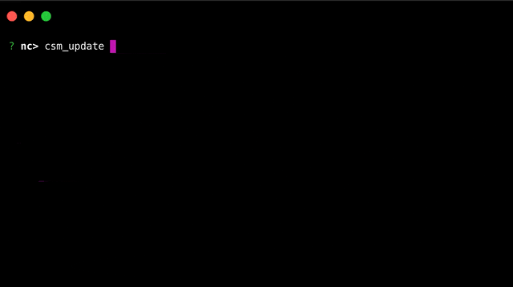

# Commander CLI

[](https://github.com/nimbella/command-sets)
[](https://nimbella-community.slack.com/)
[](https://twitter.com/intent/follow?screen_name=nimbella)
[](http://www.apache.org/licenses/LICENSE-2.0)

Commander CLI is a [Nimbella Commander](https://nimbella.com/product/commander) development tool that allows you to create, run & publish your serverless functions as commands that can run in Slack, Microsoft Teams, and Mattermost.

Here's a glimse of what you can achieve with Commander CLI:

- Run Slash commands, built for messaging platforms, from your terminal.
- Login to different Commander clients (Slack, Mattermost, Teams) directly from the terminal.
- Bootstrap Command Set development (with auto generation of the necessary files and code templates).
- Install Command Sets from your local machines onto messaging platforms.

Commander introduces the following terminology:

- **Command:** A serverless function that executes some business logic and returns output formatted for a messaging platform.
- **Command Set:** A set of related commands grouped together for easy installation and sharing.

Visit our [website](https://nimbella.com/resources-commander/overview#what-is-commander) to learn more about Commander and how it can help you extend your messaging environment with new and rich APIs.

The following guide provides details for getting started using the Commander CLI.

## Contents

- [Quick Start](#quick-start)
- [Install a Command Set](#install-a-command-set)
- [Develop a Command Set](#develop-a-command-set)
- [Install a Local Command Set](#install-a-local-command-set)
- [Publish a Command Set](#publish-a-command-set)
- [Invoke Commands Using API](#Invoke-Commands-Using-API)
- [Support](#support)
- [License](#license)

## Quick Start

The Nimbella CLI provides a convenient command-line and REPL-interface for [Commander](https://nimbella.com/product/commander). Please follow [this guide](https://nimbella.io/downloads/nim/nim.html#install-nim-globally) to install the Nimbella CLI.

You need to run the following login command before you can use the Nimbella CLI.

```sh
$ nim login
```

Run `nim commander help` to learn how to use Commander from your terminal.

```
$ nim commander help
Commander CLI
A CLI to interact with Commander from your terminal.

USAGE
$ nim commander - launch Commander REPL
$ nim commander help - display help for Commander CLI.
$ nim commander <command> [command_params/command_options] - run commander commands

REPL Commands
.exit - exit the repl
.clear - clear the repl
.help - display help in repl

Commander Commands
command_create <command> [<parameters>] ... - Creates a command & opens online source editor
csm_install <command-set> ... - Install from Nimbella Command Set Registry: https://github.com/nimbella/command-sets

Please refer https://nimbella.com/resources-commander/reference to learn about Commander commands.
```

## Install a Command Set

There are two ways to interact with Commander from the terminal. The first is the read–eval–print loop or REPL interface and the second is executing Commander commands as subcommands of `nim commander` (ex: `nim commander csm_list`). We will use the REPL to show you how to install a new Command Set.

Run the following to enter the REPL:

```sh
$ nim commander
```

**Note:** It may take up to 30 seconds to complete this command the first time you run it, as the system may need to perform some configuration to enable your Nimbella account for Commander.

Command Sets are installed using the `csm_install` command followed by the name of the Command Set. For example, to install the [`dig` Command Set](https://github.com/nimbella/command-sets/tree/master/dig), execute the command shown below.

```
? nc> csm_install dig
```

The output will resemble what is shown below.

```
? nc> csm_install dig
Installed dig command-set for app nc, containing the following commands:
dig: Perform DNS queries.
```

The Unix `dig` command allows you to query DNS records for hostnames. Now we can run it as a Command as in the example below.

```
? nc> dig nimbella.com A
nimbella.com Type: A TTL: 19 IP: 157.245.130.6
```

Checkout [Nimbella Command Set Registry](https://github.com/nimbella/command-sets) for more Command Sets.

## Develop a Command Set

The Nimbella CLI helps you develop and test Command Sets for Commander directly from your laptop or personal machine.

Let's kick start the development process with `command_set create`. The command requires an additional parameter which is the name of the Command Set.

<div align="center">

</div>

After you've run the command in the REPL and answered the questions, a directory is created with all the necessary files generated so you can get started.

The directory structure for the `greet` example will be resemble the following:

```sh
greet
├── README.md
├── commands.yaml
└── packages
    └── greet
        ├── hello.js
        └── hola.js
```

The template generation includes sample code, so you can immediately install the Command Set and try it out. The same project contains two commands, one called `hello` and the other called `hola`. Try running the commands shown next. Each command runs a function with returns a standard place holder response.

<div align="center">

</div>

You may edit the sample code to implement your desired logic for each command. Each command corresponds to a function in the corresponding file. The function accepts certain parameters which may be used in the code. For example, the change below will modify the command `hello` to greet a user by name. To make this change, edit `greet/packages/greet/hello.js` using your favorite code editor, and edit the `text` property inside the object returned by `_command`.

```diff
return {
    response_type: 'in_channel', // or `ephemeral` for private response
-    text:
-      'This is a default response for a newly created command with text: ' +
-     commandText,
+    text: `Hello, ${params.name}!`,
  };
```

For this to take effect in Commander, we need to update the code using `csm_update`.

<div align="center">

</div>

Congrats! You now know how to develop a Command Set using the Commander CLI. Try to modify `hola` now on your own.

## Install a Local Command Set

In this section, you will learn how to install a Command Set whose code is on your local machine.

You need to provide the location of the Command Set to `csm_install` to install it.

```
? nc> csm_install /your/path/to/greet
```

> **Note**: even relative paths work.

That’s it. You can now run the commands available in your locally developed command set from the Commander CLI.

To be able to access these commands from messaging platforms, you need to run the same command, but you should do it **after** you've logged in to your messaging platform from Commander CLI.

**How to login to your messaging platform from Commander CLI**

You need a `cli-login` token to login to your messaging platform (Slack, Mattermost, Teams) from Commander CLI.

Run `/nc app_info` in your messaging platform to obtain the `cli-login` token.

After you've obtained the token, run the below command with your token in Commander CLI to login to your messaging platform.

```
? nc> login <your_login_token>
```

You can also switch the login context between CLI and messaging platform by running `login` without arguments.

```
? nc> login
```

## Publish a Command Set

There are two options to distribute and share a Command Set that you develop: via your GitHub Repository or via the Nimbella Command Set Registry.

1. Publish as a GitHub Repository

   Create a GitHub repository with your code and make sure `commands.yaml` is at the root of the repository.

   To install Command Sets that are published as GitHub repositories, you need to run `/nc csm_install github:<your_github_username>/<repository_name>`. Ex: `/nc csm_install github:nimbella/greet`

2. Publish to Nimbella Command Set Registry

   Make a Pull Request to our [registry](https://github.com/nimbella/command-sets) with your Command Set. See our [contribution](https://github.com/nimbella/command-sets/blob/master/CONTRIBUTING.md) guide on the registry to learn more.

   After your Command Set is in the registry, you can install it by running: `/nc csm_install <command_set_name>`. Ex: `/nc csm_install greet`

## Invoke Commands Using API

Any command of a Command Set that's installed can be invoked programmatically.

Use `api_get` to get an endpoint for a command.

The output will also include the credentials required to execute the command. I've redacted them here.

```
? nc> api_get hello Nimbella
Command parameters:
    {
      "user_id": "...",
      "team_id": "...",
      "command": "/nc",
      "syncRequest": "true",
      "text": " hello Nimbella"
    }

    You can invoke the command with nim by running:

    nim action invoke --auth=...:... /nc/portal/cli-gateway --result  -p __ow_headers '{"accept": "application/json", "content-type": "application/x-www-form-urlencoded", "user-agent": "commander-cli" }' -p command /nc -p syncRequest '"true"' -p text ' hello Nimbella' -p user_id ... -p team_id ...

    You can also invoke the command with curl by running:

    curl -H "Content-Type: application/json" -H "User-Agent: commander-cli" --user "...:..." --data '{"user_id":"...","team_id":"...","command":"/nc","syncRequest":"true","text":" hello Nimbella"}' -X POST https://apigcp.nimbella.io/api/v1/web/nc/portal/cli-gateway
```

## Support

We're always happy to help you with any issues you encounter. You may want to [join our Slack community](https://nimbella-community.slack.com) to engage with us for a more rapid response.

## License

Apache-2.0. See [LICENSE](LICENSE) to learn more.
